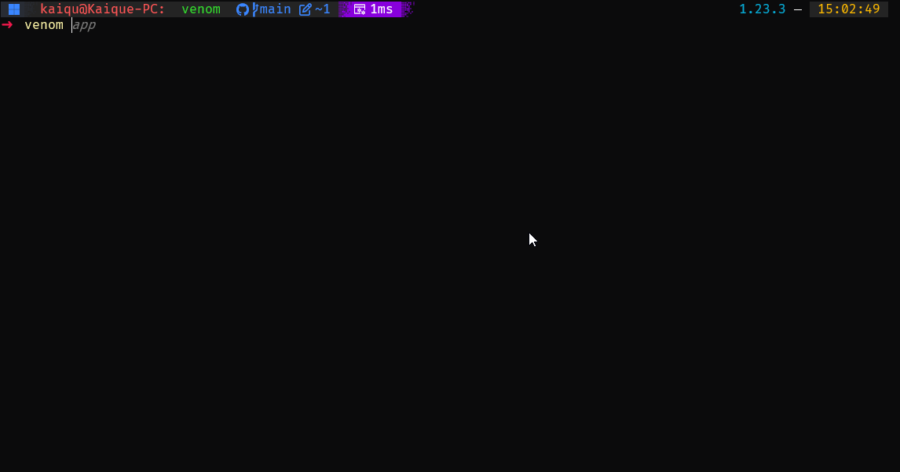
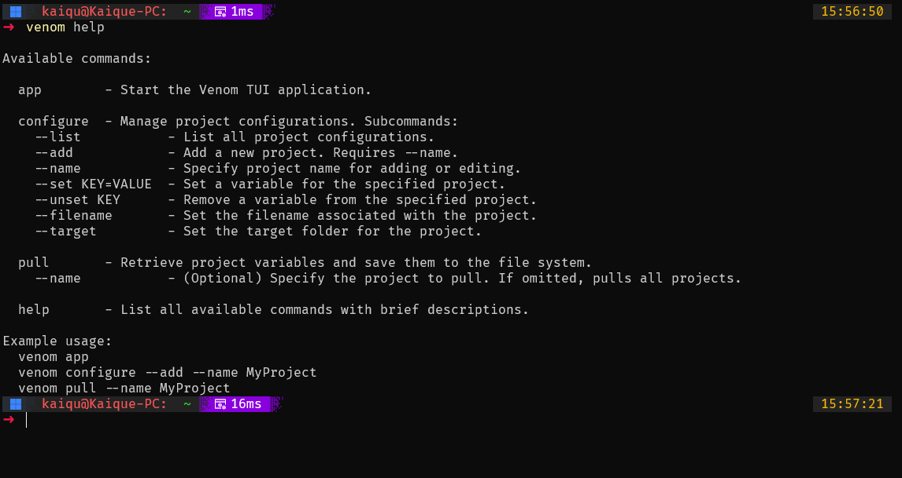

# Venom

Venom is a lightweight tool that helps you manage environment variables across different projects using a NoSQL database. It comes with a TUI (Text User Interface) built with [Bubble Tea](https://github.com/charmbracelet/bubbletea) to make configuration quick and intuitive.

---

## TUI Demonstration

**

---

## Features

- **NoSQL Backing**: Stores configuration in a Couchbase bucket for easy retrieval.  
- **TUI**: Interactively view, create, edit, or delete environment variables.  
- **CLI Commands**: Configure projects, pull updated environment variables, or launch the TUI from your terminal.  
- **File System Sync**: Generate `.env`-like files for each project based on the stored variables.

## Requirements

- **Go** (1.20 or higher recommended)  
- **Couchbase** (Connection details set in your `.env` file)

## Installation

1. Clone the repository:

   ```bash
   git clone https://github.com/KaiqueGovani/venom.git
   cd venom
   ```

2. Create a `.env` file containing your Couchbase credentials:

   ```bash
   COUCHBASE_CONNECTION_STRING=your-couchbase-server
   COUCHBASE_USERNAME=your-username
   COUCHBASE_PASSWORD=your-password
   ```

3. Build and install:

   ```bash
   go install ./cmd/venom
   ```

4. Ensure your `$GOPATH/bin` is in your PATH, or run Venom directly from the build output.

---

## CLI Demonstration

**

---

## Usage

Venom uses a set of subcommands to manage your environment variables:

- **`venom app`**  
  Launches the Venom TUI. From here, you can browse, add, edit, and delete project configurations.

- **`venom configure`**  
  Manage project settings from the CLI. Common flags:
  - `--list` List all projects
  - `--add` Add a new project (requires `--name`)
  - `--name <NAME>` Specify a project name
  - `--set KEY=VALUE` Set a variable on the specified project
  - `--unset KEY` Remove a variable from the specified project
  - `--filename` Update the project’s filename
  - `--target` Update the project’s target folder

- **`venom pull`**  
  Pull project variables down to your file system. If you pass `--name MyProject`, it only pulls that project’s variables. Otherwise, pulls all.

- **`venom help`**  
  Displays a list of available commands and flags.

### Example CLI Workflow

1. **Add a new project:**

   ```bash
   venom configure --add --name MyProject
   ```

2. **Set a variable:**

   ```bash
   venom configure --name MyProject --set API_KEY=12345
   ```

3. **Pull variables to your file system:**

   ```bash
   venom pull --name MyProject
   ```

4. **Launch the TUI to explore projects interactively:**

   ```bash
   venom app
   ```

---

## File System Sync

When you run `venom pull`, Venom writes your environment variables to the file you defined (`project.FileName`) in your chosen target folder (`project.TargetFolder`). If the file already exists, Venom warns you and overwrites the file.

---

## Contributing

Contributions are welcome! Feel free to open an issue or pull request if you find a bug or have a feature request.

---

**We are Venom!**  